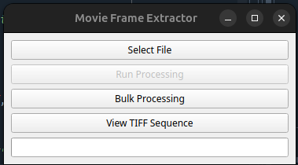
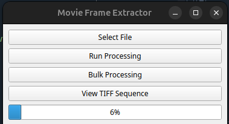
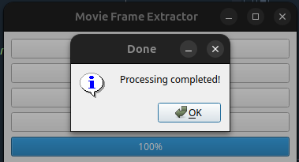
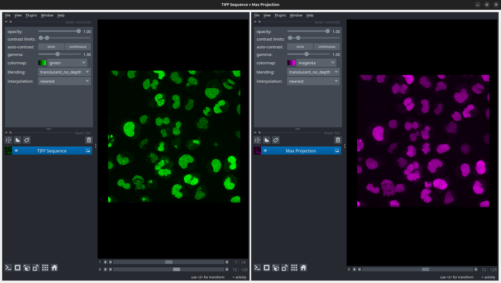

# bigFishLive

### Step 1. Convert movie file to a sequence of TIFFs

run the script in the segmentation folder called "file_convert_x2tiff.py"
A dialogue box opens up with 3 options.

1. Select a single file to process
2. Select a folder to process movies in bulk
3. Select a folder with .tif files to view

If you want to process a single file, click on the "Select File" button and navigate to the file to select it. A pop up appears showing the name of the file selected, click OK. Now the button "Run Processing" will be un-grayed. Click this button to start processing. The progress bar starts updating.

Once complete, a pop will appear as  below. Click OK

If you want to use the viewer functionality click on the last option "View TIFF Sequence" and a viewer appears as shown below. 

The left side shows the 4-D movie whereas the right side shows a maximum intensity projection along the Z-axis.

